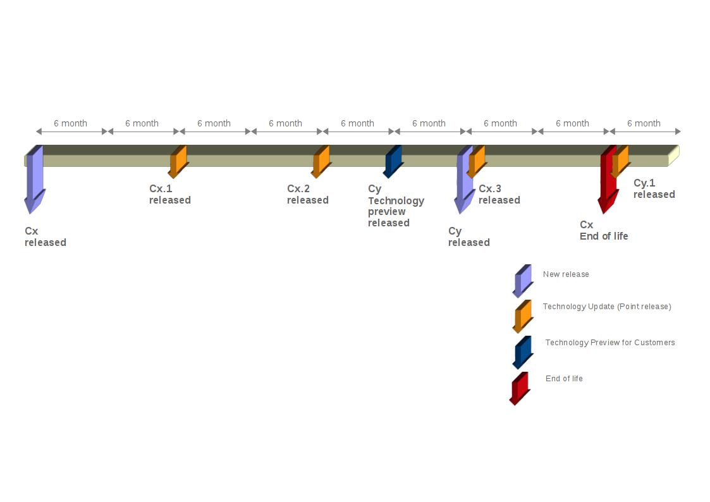

.. _long term support:

Long Term Support
~~~~~~~~~~~~~~~~~

Pardus Long Term Support (LTS) distribution is being released every 3 years, and maintained 1 year after the consecutive LTS release. This duration may be further extended by contract for paying customers.

Pardus LTS releases first technology preview is released 6 months before the final release date. This preview release will be heavily tested by the customers, independent software developers, vendors, system integrators, and solution partners.

Pardus also release `point LTS release`_  once a year.

Pardus LTS release provides both desktop and server solutions for enterprise deployments.

Long Term Support Policy Details
================================

#. The package ownership belongs to TUBITAK/BILGEM staff, but the contributions can be done via sending patches to related bug on bugzilla_ or `issue tracking system`_. See `expected developer process`_ for details.
#. Package updates will be more conservative and controllable. See `package update process`_ for details.
    They are released regularly based on the following rules:
        - Security updates will be released promptly
        - Critical updates will be released every month
        - Technological updates will be released once a year.

#. During maintenance phase, software packages will not be updated to their new major upstream releases unless it is justified. See `exception process`_ for details.
#. Repository granularity
    #. In order to provide the highest quality and stability in Official Pardus LTS release, the official repository is limited to a number of carefully chosen packages. Users can optionally install and use packages that are not in the official repository by using additional repositories.
    #. Excluding server and network solutions, it is preferred that LTS repository does not contain redundant software packages which implement the same functionality.

#. Addition of new features during the life time of a specific LTS release is limited to some well defined exceptions:
    #. Adding support for new hardware and server
    #. Implementing a missing functionality in a component which will probably be needed to satisfy the original reasons for LTS creation. Example: Enabling a specific database driver in a backup software.
#. Tests are much more important. As we mention, we constrain `new features`_, `new packages`_ and `package updates`_, and we extend our test process for them.

Long Term Support Schedule
==========================

Development for the new LTS release cycle takes approximately 1 year, which is twice the time we take for a regular Pardus release, in order to harden functionality and ensure stability.

We extend especially our stabilization phase (beta phase). Because we ship a technology preview 6 months before the final release and during the last 6 months, we deeply review, fix and test the bugs that are reported by customers and other LTS users.

.. _point LTS release: ../../guides/releasing/official_releases/point_release_process.html
.. _bugzilla: http://bugs.pardus.org.tr/
.. _issue tracking system: http://tracker.pardus.org.tr/
.. _expected developer process: ../../guides/newcontributor/mentoring_process.html
.. _exception process: ../../guides/releasing/freezes/freeze_exception_process.html
.. _package update process: ../../guides/packaging/package_update_process.html
.. _package updates: ../../guides/packaging/package_update_process.html
.. _new features: ../../guides/newfeature/newfeature_requests.html
.. _new packages: ../../guides/newfeature/new_package_requests.html

