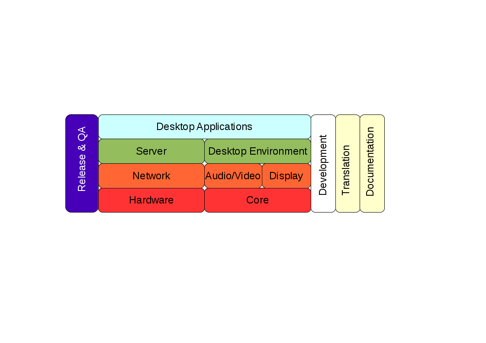

.. _developer-teams:

Pardus Teams
============

In open source projects, people enjoy sharing their knowledge and they hope to learn from the knowledge they receive from others. Together participants are able to achieve great things. A complex software program cannot be created without the help of others. The activities that need to be performed in the communities are different. Examples are the actual creation of new source code; testing the software in all sorts of settings; finding, reporting and fixing bugs; translating software into different languages; writing manuals and other documents; and creating and maintaining support tools, like a website, mailing list. Therefore  open source project life cycles can go-ahead with all of these activities, with people who have different skills. Each performs a part in the quest to together improve the quality of the software. Therefore Pardus has different teams for each different activities.

Core
----

This team create a running and installable basic system.

Main subcomponents of these team:

* Kernel
* Booting
    * Boot loader (GRUB, syslinux, isolinux, ...)
    * Boot splash (plymouth, ...)
    * initramfs
* Toolchain (system.devel)
* Configuration management (CoMar)
* Package management (PiSi)
* Init system (müdür/systemd)
* Installer (YALI)
* Utilities
* Libraries

Hardware
--------

This team is dealing with hardware integration of system user-space.

Main subcomponents of these team:

* Printer drivers
* Scanner subsystem
* Webcam/TV/V4L
* Firewire
* Bluetooth
* Optical
* Virtualization tools/API
* Pulseaudio
* ALSA

Network
-------

This team is dealing with basic networking services and tools

Main subcomponents of this team:

* Network-manager
* Firewall
* VPN
* Network tools and infrastructure

Audio/Video
-----------

This team is dealing with A/V frameworks and codecs

Main subcomponents of this team:

* Codecs
* APIs and libraries
* Plug-ins

Display
-------

This team is dealing with graphics subsystem.

Main subcomponents of this team:

* Display server (X11, wayland, ...)
* Display manager (kdm, ...)
* Display drivers

Server
------

This team is dealing with different servers

Main subcomponents of this team:

* Database
* Web
* File
* Directory
* Sharing
* PTSP

Desktop Environment
-------------------

This team is dealing with main desktop infrastructure of Pardus

Main subcomponents of this team:

* KDE
* GUI toolkits (Qt, gtk, ...)

Desktop Applications
--------------------

This team is dealing with user applications which has a GUI

Main subcomponents:

* Office
* Internet
* System Management
* Multimedia
* Graphics

Release
-------

This team is dealing with tools for release development and management

* Repo admin (in charge of merging updates and new packages, commissioning releases)
* Farm admin (in charge of running and troubleshooting the build farm)
* Build Farm/Service (development of ...)
* Media tool (Pardusman)
* Bugzilla
* Redmine
* Community tools (git, builtbot, svn, ...)

QA
--

This team is dealing with quality assurance

* Security
* Test
* QA
* Bug triage

Development
-----------

This team is dealing with development tools

Main subcomponents of this team:

* Programming (Languages, environments, tools, build system etc.)
* Editor
* Utilities

Translation
-----------

Documentation
-------------
