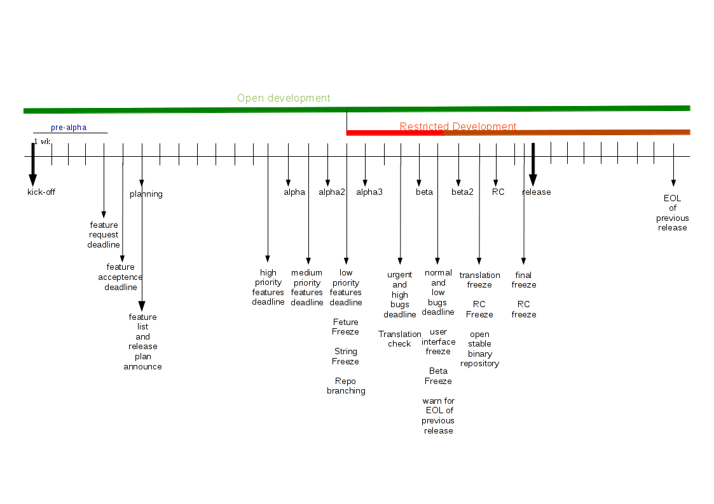

Release Process
===============

In Pardus, we follow a time-based release approach, thus we have fixed dates for various steps of development. This means that, if a feature or a bug fix is not finished on time, then we just do not include it, unless it is one of the exceptional cases defined in `freeze exceptions`_ doc.

Thus, it is important that every contributor is aware of the release process and comply with the process and work in coordination to finish on time. You can see a discussion about `time-based release management`_.

Pardus releases occur nearly every 8 months. Each release cycle follows the release plan template, which divides development into milestones that are described in `General Milestones`_ section. We also define various freeze times described in `General Freezes`_ section.

General Freezes
---------------

Open developement
^^^^^^^^^^^^^^^^^

- Unrestrained general development activity, new packages, new features and versions are automatically taken and merged without any permission.

Repo Branching
^^^^^^^^^^^^^^
- At the end of this phase all merge work of packages of previous Pardus release should be finished.
- New package creations should also be finished
- After this period, new packages and new versions can be merged under some permissions and restrictions. (see `freeze exceptions`_)
- In this freeze time devel repository is branched and testing repository is open.
- See `Repo Branching`_ for details

Feature Acceptence Deadline
^^^^^^^^^^^^^^^^^^^^^^^^^^^

- All features from users should be reported to Bugzilla before this deadline

Feature freeze
^^^^^^^^^^^^^^
- New features can not be added to the repositories, only bug fixes can be done.
- See `feature freeze`_ for details

User interface freeze
^^^^^^^^^^^^^^^^^^^^^
- User interface can not be chaged after this time
- It is needed for documentation and screenshots stabilization.
- See `user interface freeze`_ for details

Beta freeze
^^^^^^^^^^^

- The repository is freezed until beta is released, in order to stabilize beta for tests and reach beta to a level similar to final release
- Bug fixes taken to repository with release team approval
- See `Beta freeze`_ for details

String freeze
^^^^^^^^^^^^^
- In order to stabilize translations, strings should be freezed on repositories.
- See `string freeze`_ for details.

Toolchain freeze
^^^^^^^^^^^^^^^^
Last date for toolchain changes.
- See `toolchain freeze`_ for details.

Kernel freeze
^^^^^^^^^^^^^
- No new kernel versions are allowable  in order to enable last final hardware compatibility checks, deadline for kernel regression fixes
- See `kernel freeze`_ for details.

Translation freeze
^^^^^^^^^^^^^^^^^^
- No translations permitted after this point in order to enable final stabilization and last final tests.
- See `translation freeze`_ for details.

RC freeze
^^^^^^^^^^

- The repository is freezed until Final is released, in order to stabilize RC for tests and reach RC to a level similar to final release.
- Bug fixes taken to repository with release team approval
- See `RC freeze`_ for details.

Final Freeze
^^^^^^^^^^^^
Freeze time before the release is shipped.

General Milestones
------------------

Planning
^^^^^^^^
(about 1 months)

- Proposed features are discussed by developers, reviewed by technical group and release team and the final feature list is determined.
- The planned feature list and the release plan/schedule should be announced
- Pre-alpha should be released

See details from `Planning Phase`_.

Alpha 1
^^^^^^^

Intrusive changes phase completed (about 2 months)

- `Open developement`_
- High (P1) priority features and tasks finished 

See details from `Alpha phase`_

Alpha 2
^^^^^^^
(about 2 weeks)

- `Open developement`_
- Medium (p2) priority tasks and features finished
- At the end of this period, all remamined features reviewed and reprioritized or ignored if needed.

See details from `Alpha phase`_

Alpha 3
^^^^^^^
Feature development phase completed (about 2 weeks)

- `Open developement`_
- Where we are meeting to review bugs and possibility to prolonge release.
- Low (P3) priority tasks and features finished
- `Feature freeze`_
- `Repo branching`_ for main/base repo
- `String freeze`_

See details from `Alpha phase`_

Beta 1
^^^^^^
Stabilization phase (about 3 week)

- Review Beta `tracker bugs`_
- Finish high (P1) priority `tracker bugs`_
- Announce EOL of 2 previous release
- Translation and user documentation check

See details from `Beta phase`_

Beta 2
^^^^^^
Stabilization phase completed (about 2 week)

- Where we are meeting to review bugs and possibility to prolonge release.
- Finish all normal (P2), low (P3) priority `tracker bugs`_
- `Toolchain freeze`_ ?
- `User interface freeze`_
- `Beta freeze`_
- Preperation for final release announcement and marketing materials

See details from `Beta phase`_

RC
^^
(about 2 weeks)

- "Where we are meeting" to review bugs and possibility to prolonge release.
- Fix only urgent release tracker bugs, bug fix needs approval. (See `testing source repository merge process`_)
- `Kernel freeze`_
- `Translation freeze`_
- Testing targets achieved (All features functional and bug free)
- `RC freeze`_
- Final Marketing and announcement ready

See details from `RC phase`_

Final
^^^^^
(about 2 weeks)

- `Final freeze`_
- Fix only boot and installation urgent release `tracker bugs`_ and bug fix needs approval. (See `testing source repository merge process`_)
- Start new release cycle for the next release

See details from `Final phase`_

LTS technological updates (point releases)
^^^^^^^^^^^^^^^^^^^^^^^^^^^^^^^^^^^^^^^^^^

- Adding support for new hardware
- Implementing a missing functionality in a component which will probably be needed to satisfy the original reasons for LTS creation
- Reduce download for ongoing updates.
- All work must be finished one month before the release in order to give time for tests

Maintainance
^^^^^^^^^^^^

The maintenance time of a release is about previous release + 2 month (~8 months) (n +2).

Package maintainers MUST:

- Fix security vulnerability bugs
- Fix severe regressions from the previous release. This includes packages which are totally unusable, like being uninstallable or crashing on startup.
- Fix bugs that directly cause a loss of user data
- Avoid new upstream versions of packages which provide new features, but don't fix critical bugs, a backport should be requested instead.
- Avoid ABI breakage or API changes if at all possible.
- Avoid changing the user experience if at all possible.
- Avoid updates that are trivial or don't affect any user.
- Avoid adding new packages

Package maintainers SHOULD:

- Push only major bug fixes and security fixes to previous release (n-2).

See also `exception process`_.

EOL
^^^

- The EOL warning announce of a release is done at next release Beta 2 version.
- The EOL announce date of a release is next release + 2 month (n +2).

See details from `EOL`_.

.. _Planning Phase: ../../guides/releasing/official_releases/planning_phase.html
.. _tracker bugs: ../../guides/bugtracking/tracker_bug_process.html
.. _feature freeze: ../../guides/releasing/freezes/feature_freeze.html
.. _Alpha phase: ../../guides/releasing/official_releases/alpha_phase.html
.. _Beta phase: ../../guides/releasing/official_releases/beta_phase.html
.. _RC phase: ../../guides/releasing/official_releases/release_candidate_phase.html
.. _Final phase: ../../guides/releasing/official_releases/final_phase.html
.. _EOL: ../../guides/releasing/end_of_life.html
.. _time-based release management: http://fnords.wordpress.com/2011/07/01/time-based-good-for-community/
.. _freeze exceptions: ../../guides/releasing/freezes/freeze_exception_process.html
.. _Repo Branching: ../../guides/releasing/freezes/repo_freeze.html
.. _user interface freeze: ../../guides/releasing/freezes/user_interface_freeze.html
.. _string freeze: ../../guides/releasing/freezes/string_freeze.html
.. _Beta freeze: ../../guides/releasing/freezes/beta_freeze.html
.. _translation freeze: ../../guides/releasing/freezes/translation_freeze.html
.. _RC freeze: ../../guides/releasing/freezes/rc_freeze.html
.. _kernel freeze: ../../guides/releasing/freezes/kernel_freeze.html
.. _toolchain freeze: ../../guides/releasing/freezes/toolchain_freeze.html
.. _exception process: ../../guides/releasing/freezes/freeze_exception_process.html
.. _testing source repository merge process: tp://developer.pardus.org.tr/guides/packaging/package_update_process.html#merging-to-testing-source-repository:
